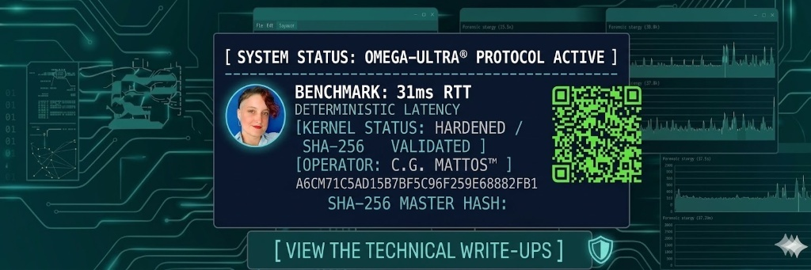

> "Latency is not a limit; it is a variable to be optimized."

| Metric | Target | Result | Status |
| :--- | :--- | :--- | :--- |
| **Local Latency** | < 50ms RTT | **31ms RTT** | **OPTIMIZED** |

# [ SYSTEM IDENTIFICATION: OMEGA-ULTRA® PROTOCOL ]

## 👤 OPERATOR IDENTITY
* **NAME:** Carolina Gabriela Mattos™
* **FIELD:** Infrastructure Engineering & Systems Hardening
* **ACADEMIC:** Advanced Psychology Candidate @ UNC (Universidad Nacional de Córdoba)
* **STATUS:** [ SOVEREIGN NODE ACTIVE / KERNEL LOCKED ]

---

## ⚡ PERFORMANCE BENCHMARKS (VERIFIED)
| Feature | Baseline | **OMEGA-ULTRA® Configuration** | **Status** |
| :--- | :--- | :--- | :--- |
| **TCP/IP Stack** | Default | **Hardened / DSCP 46 Priority** | **STABLE** |
| **Windows Registry** | Standard | **Full Forensic Hardening** | **ENFORCED** |

---

## 🛠️ CORE AUDIT CAPABILITIES
* **Kernel Optimization:** Execution of LSO/RSC bypass protocols to eliminate network interference at the hardware abstraction layer.
* **Deterministic Infrastructure:** Bufferbloat elimination via advanced QoS (Quality of Service) injection and traffic shaping.
* **Forensic Systems Analysis:** Metric extraction and auditing through direct system instrumentation and low-level telemetry.
* **Systems Psychology:** Behavioral and pattern analysis applied to flow optimization in critical infrastructures (Layer 9 Engineering).

---

## 📑 VALIDATED PROTOCOLS & DOCUMENTATION
* **Protocol OMEGA V.CORE:** Proprietary TCP/IP stack optimization for low-latency environments.
* **Forensic Clearance:** Kernel-level registry auditing for deterministic stability.
* **SHA-256 MASTER HASH:** `D444E6122A9320E19DBDFEAB9BA3B730647648856CCC43D4EB42A0042D680064`

---

## 🌐 CONNECT WITH THE NODE
* **X / Twitter:** [@OmegaUltraM](https://x.com/OmegaUltraM) — *Real-time infrastructure logs & tech insights.*
* **LinkedIn:** [Carolina Gabriela Mattos](https://www.linkedin.com/in/carolinagabrielamattos-infra)
* **Academic Email:** `carolina.mattos@mi.unc.edu.ar`

---
###### OFFICIAL DOSSIER | AUTHOR: C.G. MATTOS | INFRASTRUCTURE SOVEREIGNTY VALIDATED
