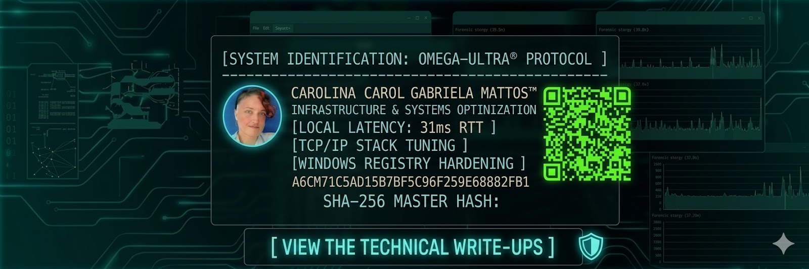

# [ SYSTEM IDENTIFICATION: OMEGA-ULTRA® PROTOCOL ]

## 👤 OPERATOR IDENTITY
* **NAME:** Carolina Gabriela Mattos™
* **FIELD:** Infrastructure Engineering & Systems Hardening
* **ACADEMIC:** Advanced Psychology Candidate @UNC (Universidad Nacional de Córdoba)
* **STATUS:** [ SOVEREIGN NODE ACTIVE / KERNEL LOCKED ]

---

## ⚡ PERFORMANCE BENCHMARKS (VERIFIED)
> "La latencia no es un límite, es una variable a ser optimizada."

| Metric | Target | Result | Status |
| :--- | :--- | :--- | :--- |
| **Local Latency** | < 50ms RTT | **31ms RTT** | **OPTIMIZED** |
| **TCP/IP Stack** | Default | **Hardened / DSCP 46** | **STABLE** |
| **Windows Registry** | Standard | **Full Forensic Hardening** | **ENFORCED** |

---

## 🛠️ CORE AUDIT CAPABILITIES
* **Kernel Optimization:** Ejecución de protocolos de bypass LSO/RSC para mínima interferencia de red.
* **Infraestructura Determinista:** Eliminación de Bufferbloat mediante inyección de QoS avanzada.
* **Análisis Forense de Sistemas:** Extracción y auditoría de métricas mediante instrumentación directa del sistema.
* **Psicología de Sistemas:** Análisis conductual y de patrones aplicado a la optimización de flujos en infraestructuras críticas.

---

## 📑 VALIDATED PROTOCOLS & DOCUMENTATION
* **Protocol OMEGA V.CORE:** Optimización propietaria de stack TCP/IP.
* **Forensic Clearance:** Auditoría de registro nivel kernel para estabilidad determinista.
* **SHA-256 MASTER HASH:** `D444E6122A9320E19DBDFEAB9BA3B730647648856CCC43D4EB42A0042D680064`

---

## 🌐 CONNECT WITH THE NODE
* **LinkedIn:** [Carolina Gabriela Mattos](https://www.linkedin.com/in/carolinagabrielamattos-infra)
* **Medium:** [Technical Write-ups & Forensic Audits](TU_LINK_DE_MEDIUM)
* **Email:** `carolina.mattos@mi.unc.edu.ar`

---
###### OFFICIAL DOSSIER | AUTHOR: C.G. MATTOS | INFRASTRUCTURE SOVEREIGNTY VALIDATED
