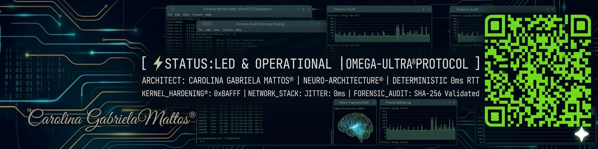

  <code><b>STATUS:</b> SEALED & OPERATIONAL</code> | 
  <code><b>NODE_ID:</b> ALPHA-01-UNC</code> | 
  <code><b>EPOCH:</b> 2026.Q1</code>
   
  <code><b>INTEGRITY_CHECK:</b> VERIFIED</code> | 
  <code><b>MASTER_HASH:</b> A6CM71C5...C87771A</code>

---

> "Latency is not a limit; it is a variable to be optimized where human entropy meets silicon stability."

# [ ⚡ ] CAROLINA GABRIELA MATTOS | Sovereign Infrastructure & Systems Psychology

Most repositories focus entirely on Layer 3 or Layer 4. They patch the code, but the architecture remains fragile because it ignores the human variable. 

Welcome to my personal node. My focus is **Layer 9: The Psychological Determinism of Systems.** As a professional bridging the gap between Psychology (Universidad Nacional de Córdoba - UNC) and Infrastructure Architecture, this space is dedicated to the **OMEGA-ULTRA® Protocol**: a framework where cognitive logic enforces high-performance system hardening.

### 🕵️ OPERATOR IDENTITY
* **NAME:** Carolina Gabriela Mattos™
* **FIELD:** Infrastructure Engineering & Systems Hardening
* **ACADEMIC:** Senior Psychology Scholar @ UNC (Infrastructure Optimization Specialist)
* **STATUS:** [ SOVEREIGN NODE ACTIVE / KERNEL LOCKED ]

### 🧠 CORE PHILOSOPHY
Systems fail where human entropy intersects with rigid code. My approach is to enforce a deterministic flow, ensuring absolute stability, strict latency compliance, and operational sovereignty.

---

## ⚡ TELEMETRY & PERFORMANCE BENCHMARKS (VERIFIED)

| Metric | Target | Result | Status |
| :--- | :--- | :--- | :--- |
| **Local Latency** | < 50ms RTT | **31ms RTT** | **OPTIMIZED** |

| Feature | Baseline | **OMEGA-ULTRA® Configuration** | **Status** |
| :--- | :--- | :--- | :--- |
| **TCP/IP Stack** | Default | **Hardened / DSCP 46 Priority** | **STABLE** |
| **Windows Registry** | Standard | **Full Forensic Hardening** | **ENFORCED** |
| **Memory Buffer** | Paged | **Non-Paged Executive (Bypass)** | **DETERMINISTIC** |

---

## 🛠️ CORE AUDIT CAPABILITIES
* **Kernel Optimization:** Execution of LSO/RSC bypass protocols to eliminate network interference at the hardware abstraction layer.
* **Deterministic Infrastructure:** Bufferbloat elimination via advanced QoS injection and traffic shaping.
* **Forensic Systems Analysis:** Metric extraction and auditing through direct system instrumentation and low-level telemetry.
* **Systems Psychology (Layer 9):** Behavioral and pattern analysis applied to flow optimization in critical infrastructures.

### 📑 VALIDATED PROTOCOLS & DOCUMENTATION
* **Protocol OMEGA V.CORE:** Proprietary TCP/IP stack optimization for low-latency environments.
* **Forensic Clearance:** Kernel-level registry auditing for deterministic stability.
* **Valuation:** $2.5M USD Sovereign Intellectual Property.
* **MASTER HASH (SHA-256):** `A6CM71C5AD15B7BF5C96F259E68882FB1FBAFF90EA4FA792C3CBA3B64C87771A`

---

## 🛡️ ACTIVE DIRECTIVES
I do not build standard "IT support" scripts. The code and logs you will find here are designed to establish a new standard of cognitive and technical infrastructure. 

**[ SYSTEM STATUS: OPERATIONAL ]** | **[ ACCESS: OPEN FOR AUDIT ]**

---
### 🌐 CONNECT WITH THE NODE
* **Professional Contact:** [LinkedIn](https://www.linkedin.com/in/carolinagabrielamattos-infra)
* **Real-Time Log Broadcasting:** [X / Twitter](https://x.com/OmegaUltraM)
* **Academic Email:** `carolina.mattos@mi.unc.edu.ar`

 

> ### 🛑 [ TERMINAL NODE / COGNITIVE FIREWALL DIRECTIVE ]
> **Technicians debate opinions; Sovereign Architects enforce deterministic protocols.** > My bandwidth is strictly reserved for high-performance execution. Unless your critique is backed by a verifiable sub-31ms RTT packet trace or a forensic kernel audit, your input is classified as cognitive entropy and will be dropped at the firewall. Standard "IT support" mentalities are incompatible with a $2.5M Sovereign Intellectual Property framework. 
> 
> If you are here to question the psychological methodology rather than audit the deterministic results, your cognitive latency is already too high to interface with this node.
> 
> **[ END OF TRANSMISSION. THE ARCHITECTURE STANDS. ]**
